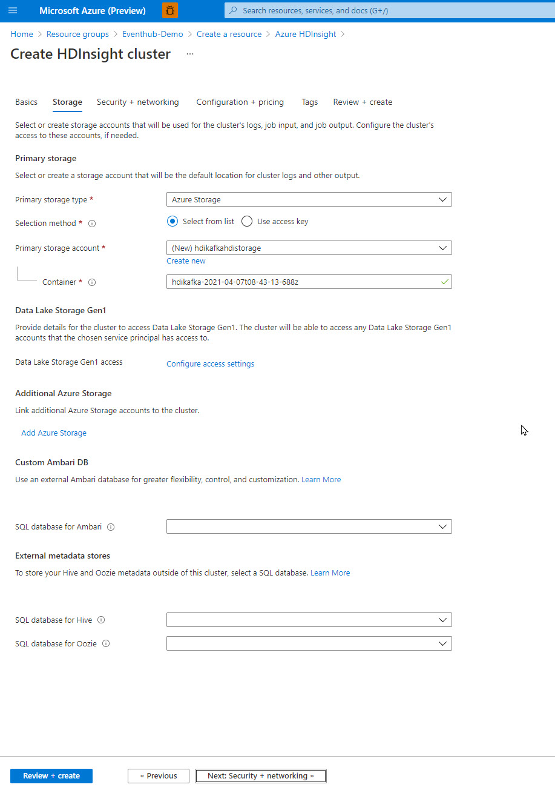
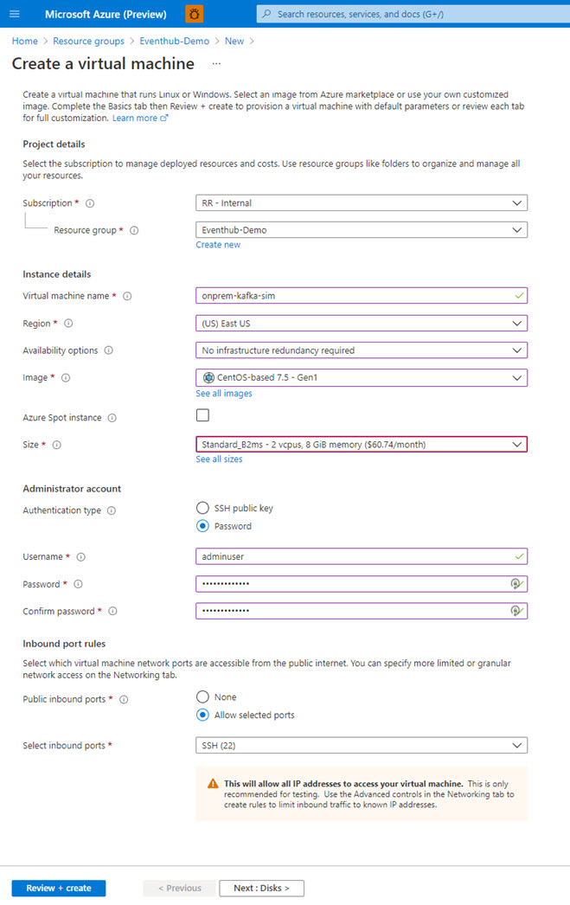

# HDI Kafka Setup	

In this tutorial, we will be exploring the use case for running Kafka on Azure HDI and the various steps involved. This was done for a customer where an on-premise Kafka was currently deployed. The customer wanted to replicate the Kafka stream from on-premises to another Kafka running on cloud (with Mirrormaker). Subsequently, this stream would be read by a spark process running in Databricks.   

In this tutorial, we would be going through the following steps:

* Deploy Azure HDI (Kafka)

* Access and configure Kafka on HDI post deployment

* Setup On-prem Kafka Instance (this will be simulated with installing Kafka in a VM)

* Configure MirrorMaker for replication of Kafka Events

* Deploy Databricks Cluster [WIP]

* Setup a sample spark code to read from the HDI Kafka instance [WIP]

  

## How Kafka Mirroring Works

Mirroring works by using Mirrormaker tool (part of Apache Kafka) to consume records from one topic on the primary cluster and then by creating a copy on the secondary or the target cluster.  The most useful mirroring setup for disaster recovery utilizes Kafka clusters in different Azure regions. To achieve this, the virtual networks where the clusters reside would be peered together. 

The following diagram illustrates the mirroring process and how the communication happens between the clusters:


[Source Article]([Mirror Apache Kafka topics - Azure HDInsight | Microsoft Docs](https://docs.microsoft.com/en-us/azure/hdinsight/kafka/apache-kafka-mirroring))

The primary and the secondary clusters can have different configurations for number of nodes, partitions  and offsets and may have different topics in them as well. Mirroring maintains the key value that is used for partitioning, so the record is preserved on a per key basis. 

Key considerations across networks:

* Gateways: the network must be able to communicate at the TCP/IP level

* Server Addressing: You can choose FQDN or the IP. In this particular lab, the clusters will be referred to by IPs. 

  

### Peering Setup

Before we deploy our HDI and on-prem kafka instance, let's set up the following:

* Resource Group where HDI would be deployed. 
* Resource Group where Kafka On-prem will be deployed. Since we are simulating an on-prem environment, we are doing this by deploying a single node kafka VM inside another resource group. 
* Set up VNETs for both resource groups. 
* Create VNET peering between both VNETs. 
* **Important** : Enable the VNET peering **before** deploying the HDI cluster, as otherwise the gateway information would need to be changed, and this may not be possible without a cluster restart and/or change in IPs. 


### Deploy Azure HDI (Kafka)

For the purpose of this tutorial, we assume that you have access to an Azure subscription and are able to create resources. 

Search for HDI in Azure Marketplace. Click 'Create'.


In this example, we will create an HDI Cluster just for Kafka. Choose 'Cluster Type' as 'Kafka' and provide a userid/password for cluster login.

We'll keep all other options as default, for now. Click 'Review + Create'. 


Leave the options as default in the storage setup. 



**Important:**  Ensure that the VNET created for this HDI Cluster/Resource Group is selected in this page. 


Choose the size of the cluster. For our deployment, we will choose a cluster with 3 worker nodes. Sizing as a topic will not be covered in this article. 


Once all validations have succeeded, the cluster will get created. This deployment could take anywhere between 10-30 mins. 


### Post Deployment Configuration on HDI

Once the cluster has been successfully deployed, access Ambari from the cluster home page. 


Login to Ambari dashboard with the credentials provided during the cluster creation process. 

Click on Kafka in the Ambari dashboard. 


This page will show the status of all the Ambari services. Click on 'Config' as we will make changes for IP Advertising (so that our services are accessible by IP) and also to ensure that our listener is listening on all IPs.

In the config screen, open the 'Advanced kafka-env' block. 

Add the following lines at the end of the config:

```
# Configure Kafka to advertise IP addresses instead of FQDN
IP_ADDRESS=$(hostname -i)
echo advertised.listeners=$IP_ADDRESS
sed -i.bak -e '/advertised/{/advertised@/!d;}' /usr/hdp/current/kafka-broker/conf/server.properties
echo "advertised.listeners=PLAINTEXT://$IP_ADDRESS:9092" >> /usr/hdp/current/kafka-broker/conf/server.properties
```


In the kafka brokers section, change listeners property to `PLAINTEXT://0.0.0.0:9092`

Click Save. Select 'restart' and 'Confirm restart all'.

Post restart, validate that all services are up, using the Ambari dashboard. 

*Tip*: The internal IPs for all kafka services are available in the hosts section in Ambari:

Make a note of these IPs as we will need them later.  The naming convention is as follows:

* hnx - Head Nodes

* wnx - Kafka Broker Nodes

* zkx - Kafka Zookeeper Nodes

  


### Access and configure Kafka on HDI post deployment

Once our cluster is successfully deployed, we can connect to the cluster using the ssh command.  Edit the command below by replacing the name of the cluster and then enter the command. 

`ssh sshuser@CLUSTERNAME-ssh.azurehdinsight.net`

Once connected, the screen output would be as follows:

```
Authorized uses only. All activity may be monitored and reported.
sshuser@hXXXXXXXX-ssh.azurehdinsight.net's password:
Welcome to Ubuntu 16.04.7 LTS (GNU/Linux 4.15.0-1109-azure x86_64)

 * Documentation:  https://help.ubuntu.com
 * Management:     https://landscape.canonical.com
 * Support:        https://ubuntu.com/advantage
   Welcome to Ubuntu 16.04.7 LTS (GNU/Linux 4.15.0-1109-azure x86_64)

 * Documentation:  https://help.ubuntu.com
 * Management:     https://landscape.canonical.com
 * Support:        https://ubuntu.com/advantage

12 packages can be updated.
5 of these updates are security updates.
To see these additional updates run: apt list --upgradable
*** /dev/sda1 will be checked for errors at next reboot ***
*** System restart required ***

Welcome to Kafka on HDInsight.
The programs included with the Ubuntu system are free software;
the exact distribution terms for each program are described in the
individual files in /usr/share/doc/*/copyright.

Ubuntu comes with ABSOLUTELY NO WARRANTY, to the extent permitted by
applicable law.

To run a command as administrator (user "root"), use "sudo <command>".
See "man sudo_root" for details.

sshuser@hn0-hdiscb:~$
```

After connecting to the cluster, we need to identify the *Apache Zookeeper* and *Broker* information. These are referenced by Kafka and other utilities as will be seen later in the tutorial. 

We will use Ambari REST API on the cluster to get host information. 

Tip: Install [jq](https://stedolan.github.io/jq/), a command line processor to help with parsing JSON documents.

To install jq, execute the following:

```
sudo apt -y install jq
```

Set up password variable. Replace `PASSWORD` with cluster login password and enter:

```
export password='PASSWORD'
```

We need to now extract the cluster name (in correct case). The following command extracts the cluster name and stored it in a variable. 

```
export clusterName=$(curl -u admin:$password -sS -G "http://headnodehost:8080/api/v1/clusters" | jq -r '.items[].Clusters.cluster_name')
```

Let's also extract Zookeeper hosts information:

```
export KAFKAZKHOSTS=$(curl -sS -u admin:$password -G https://$clusterName.azurehdinsight.net/api/v1/clusters/$clusterName/services/ZOOKEEPER/components/ZOOKEEPER_SERVER | jq -r '["\(.host_components[].HostRoles.host_name):2181"] | join(",")' | cut -d',' -f1,2);
```

To confirm the Kafka Hosts information, type the following and note the hosts:

```
echo $KAFKAZKHOSTS

zk0-hdixxx.fuxxxxxxdlujcxxxxxaid.bx.internal.cloudapp.net:2181,zk1-hdiscb.fuxxxxxxdlujcxxxxxaid.bx.internal.cloudapp.net:2181
```

Let's also setup a variable to store the Apache Kafka Broker host information:

```
export KAFKABROKERS=$(curl -sS -u admin:$password -G https://$clusterName.azurehdinsight.net/api/v1/clusters/$clusterName/services/KAFKA/components/KAFKA_BROKER | jq -r '["\(.host_components[].HostRoles.host_name):9092"] | join(",")' | cut -d',' -f1,2);
```

Let's validate the Kafka Brokers:

```
echo $KAFKABROKERS

wn0-hdiscb.fuxxxxxxdlujcxxxxxaid.bx.internal.cloudapp.net:9092,wn1-hdiscb.fuxxxxxxdlujcxxxxxaid.bx.internal.cloudapp.net:9092
```

Let's also create another variable to store the Kafka broker IPs and Zookeeper hosts

```
export SECONDARY_BROKERS=10.0.2.13:9092,10.0.2.7:9092,10.0.2.12:9092
export SECONDARY_ZKHOSTS=10.0.2.10:2181,10.0.2.5:2181,10.0.2.11:2181
```


### Setup On-Prem Kafka

In this scenario, our customer already has a Kafka deployment on-premises that they want to replicate messages from. In this tutorial, we will simulate this by deploying Kafka on an Azure VM and setup replication from this Kafka instance to the HDI Kafka that we have deployed above. 

An important consideration here is also for Eventhub, as an option for Azure HDI Kafka. Eventhub is also able to get data from a Kafka instance, with the additional benefits of then being able to store this data in ADLS and/or leveraging Stream Analytics to then integrate with the stream.

Let's start with deploying a VM on Azure. For this, an ideal option is the OpenLogic Centos VM (7.5) V1. Since we wouldn't be doing much heavy lifting here, we can use the Standard B2ms shape for it, without any replication. 

Deploy the VM using marketplace.



Keep all settings as default and click 'Review + Create'.


Once the VM is deployed, we'll connect to using ssh and install Kafka from command line. 

Download the latest Kafka and extract it:

```
wget https://apachemirror.sg.wuchna.com/kafka/2.7.0/kafka_2.13-2.7.0.tgz

tar -xzf kafka_2.13-2.7.0.tgz
```

Install Java 8+

```
sudo yum install java-1.8.0-openjdk
```

Validate Java Install:

```
java -version
openjdk version "1.8.0_282"
OpenJDK Runtime Environment (build 1.8.0_282-b08)
OpenJDK 64-Bit Server VM (build 25.282-b08, mixed mode)
```

Configure JAVA_HOME

```
#Find the Java Path
update-alternatives --config java


There is 1 program that provides 'java'.

  Selection    Command
-----------------------------------------------
*+ 1           java-1.8.0-openjdk.x86_64 (/usr/lib/jvm/java-1.8.0-openjdk-1.8.0.282.b08-1.el7_9.x86_64/jre/bin/java)

Enter to keep the current selection[+], or type selection number:

#Update .bash_profile and add JAVA_HOME
export JAVA_HOME=/usr/lib/jvm/java-1.8.0-openjdk-1.8.0.282.b08-1.el7_9.x86_64/jre

#Save the file and source it
source .bash_profile

echo $JAVA_HOME
```

Change server.properties to have the listener on the local ip of this host and advertise the IP

The server.properties file is located in your kafka_directory/config. In our case it is at /kafka_2.13-2.7.0/config

Change the following 3 settings in server.properties to the IP of the host where kafka is running.

```
listeners=PLAINTEXT://10.1.0.4:9092
advertised.listeners=PLAINTEXT://10.1.0.4:9092
zookeeper.connect=10.1.0.4:2181
```

Next, let's also change the consumer.properties in the same folder to also reflect the change. Change the following property as follows:

```
bootstrap.servers=10.1.0.4:9092
group.id=mirrorgroup
```

Lastly, change the producer.properties as follows to ensure that all services are connecting to kafka on the correct ip and port:

```
bootstrap.servers=10.1.0.4:9092
```

Start the Kafka environment:

```
cd kafka_2.13-2.7.0

# Start the ZooKeeper service
$ bin/zookeeper-server-start.sh config/zookeeper.properties
```

Then open another terminal session and run:

```
cd kafka_2.13-2.7.0

# Start the Kafka broker service
$ bin/kafka-server-start.sh config/server.properties
```

All services started !


Let's create a topic to store events (open another terminal):

```
cd kafka_2.13-2.7.0

bin/kafka-topics.sh --create --topic quickstart-events --bootstrap-server 10.1.0.4:9092

Created topic quickstart-events.
```

Let's validate the partition count of the new topic:

```
bin/kafka-topics.sh --describe --topic quickstart-events --bootstrap-server 10.1.0.4:9092

Topic: quickstart-events        PartitionCount: 1       ReplicationFactor: 1    Configs: segment.bytes=1073741824
        Topic: quickstart-events        Partition: 0    Leader: 0       Replicas: 0     Isr: 0
```

Let's send some data to this topic with a console producer. (Ctrl+C to exit)

```
bin/kafka-console-producer.sh --topic quickstart-events --bootstrap-server 10.1.0.4:9092
This is Event 1
This is Event 2

```

Let's read this back from the console consumer:

```
bin/kafkbin/kafka-console-consumer.sh --topic quickstart-events --from-beginning --bootstrap-server 10.1.0.4:9092
This is Event 1
This is Event 2
^CProcessed a total of 2 messages
```

Reference: [Apache Kafka](https://kafka.apache.org/quickstart)

### Configure MirrorMaker for replication of Kafka Events

Kafka MirrorMaker allows for the "mirroring" of a stream. Given source and destination Kafka clusters, MirrorMaker will ensure any messages sent to the source cluster will be received by both the source *and* destination clusters. In this example, we'll show how to mirror a source Kafka cluster with a destination Kafka-enabled HDInsight cluster. This scenario can be used to send data from an existing Kafka pipeline on-premises to Kafka running on Azure without interrupting the flow of data.

Check out the [Kafka Mirroring/MirrorMaker Guide](https://cwiki.apache.org/confluence/pages/viewpage.action?pageId=27846330) for more detailed information on Kafka MirrorMaker. 

Reference: Additional tutorial for setting up mirrormaker to replicate from Kafka to Event Hub is available [here](https://github.com/Azure/azure-event-hubs-for-kafka/tree/master/tutorials/mirror-maker)

#### Configuration

To configure Kafka MirrorMaker, we'll give it a Kafka cluster as its consumer/source and a Kafka-HDI cluster as its producer/destination.

Consumer configuration:

A consumer.properties file is used to configure communication with the primary cluster. To create the file, use the following commands. 

```
#ssh to your HDI Kafka Cluster
ssh sshuser@HDIKAFKACLUSTER-ssh.azurehdinsight.net
nano consumer.properties
```

Use the following text as the contents of the file:

```
bootstrap.servers=PRIMARY_BROKERS
group.id=mirrorgroup
```

Replace PRIMARY_BROKERS with the Broker IP address from the primary (on-prem) cluster for e.g.

```
bootstrap.servers=10.1.0.4:9092
group.id=mirrorgroup
```

This file describes the consumer information to use when reading from the primary Kafka cluster. For more information consumer configuration, see [Consumer Configs](https://kafka.apache.org/documentation#consumerconfigs) at kafka.apache.org.

To save the file, use **Ctrl + X**, **Y**, and then **Enter**.

Producer Configuration

A `producer.properties` file is used to communicate the **secondary** cluster. To create the file, use the following command:

```
nano producer.properties
```

Use the following text as the contents of the `producer.properties` file (variable created during cluster setup):

```
bootstrap.servers=SECONDARY_BROKERS
compression.type=none
```

Replace KAFKABROKERS with the Broker IPs of the HDI Cluster.

```
bootstrap.servers=10.0.2.13:9092,10.0.2.7:9092,10.0.2.15:9092
compression.type=none
```

For more information producer configuration, see [Producer Configs](https://kafka.apache.org/documentation#producerconfigs) at kafka.apache.org.

The default configuration for Kafka on HDInsight doesn't allow the automatic creation of topics. You must use one of the following options before starting the Mirroring process:

This option also allows you to set the number of partitions and the replication factor.

You can create topics ahead of time by using the following command:

```
/usr/hdp/current/kafka-broker/bin/kafka-topics.sh --create --replication-factor 2 --partitions 3 --topic quickstart-events --zookeeper $SECONDARY_ZKHOSTS
```

**Configure the cluster for automatic topic creation**: This option allows MirrorMaker to automatically create topics, however it may create them with a different number of partitions or replication factor than the primary topic.

To configure the secondary cluster to automatically create topics, perform these steps:

1. Go to the Ambari dashboard for the secondary cluster: `https://SECONDARYCLUSTERNAME.azurehdinsight.net`.
2. Click **Services** > **Kafka**. Click the **Configs** tab.
3. In the **Filter** field, enter a value of `auto.create`. This filters the list of properties and displays the `auto.create.topics.enable` setting.
4. Change the value of `auto.create.topics.enable` to true, and then select **Save**. Add a note, and then select **Save** again.
5. Select the **Kafka** service, select **Restart**, and then select **Restart all affected**. When prompted, select **Confirm restart all**.

Run MirrorMaker

Run the Kafka MirrorMaker from the ssh connection of the HDI Cluster: 

```
/usr/hdp/current/kafka-broker/bin/kafka-run-class.sh kafka.tools.MirrorMaker --consumer.config consumer.properties --producer.config producer.properties --whitelist testtopic --num.streams 3
```

No messages are displayed in the console for MirrorMaker. Ideally, this would be a process that would be configured to execute one the kafka cluster starts. Mirrormaker allows whitelisting of topics, so there would be 1 MirrorMaker executable process for every source cluster being replicated into the target. 

Let's test to check if the process is working by sending a few messages using the kafka-console-producer in the source cluster, and test if they have been replicated in the destination cluster by using kafka-console-consumer. 

Source:

```
cd kafka_2.13-2.7.0
bin/kafka-console-producer.sh --topic quickstart-events --bootstrap-server 10.1.0.4:9092
>This is Test Message 1
>This is Test Message 2
>This is Test Message 3
```

Target: 

SECONDARY_BROKERS has the IPs of all the HDI Brokers:

```
/usr/hdp/current/kafka-broker/bin/kafka-console-consumer.sh --bootstrap-server $SECONDARY_BROKERHOSTS --topic quickstart-events --from-beginning
This is Test Message 1
This is Test Message 2
This is Test Message 3
```

If you go to the previous producer window for the source, and send in additional messages, you would be able to see them coming in real time. 

As we might have multiple clusters deployed, let's also check how are clusters are performing with messages coming in from source. 

Kafka Consumer Offset checker command line is used to assess how the mirror is keeping up with the source. Offset checker checks the number of messages read and written, and reports the lag for each consumer in a specified consumer group. 

The following command runs the Consumer Offset Checker for group mirrorgroup, topic quickstart-events. The --zkconnect argument points to the Zookeeper host and port on the source cluster. 

```
/usr/hdp/current/kafka-broker/bin/kafka-run-class.sh kafka.tools.ConsumerOffsetChecker --group mirrorgroup --zkconnect 10.1.0.4:2181 --topic quickstart-events

Group        Topic                Pid Offset     logSize     Lag     Owner
mirrorgroup  quickstart-events     0   5          5           0       none
```

**Important** : After version 0.9.0.0, kafka.tools.ConsumerOffsetChecker is no longer supported and will result in a class not found error. The command to be used is kafka-consumer-groups to manage consumer groups. 

This tool is primarily used for describing consumer groups and debugging any consumer offset issues, like consumer lag. The output from the tool shows the log and consumer offsets for each partition connected to the consumer group that is being described. You can see at a glance which consumers are current with their partition and which ones are lagging. From there, you can determine which partitions (and likely the corresponding brokers) are slow.

```
/usr/hdp/current/kafka-broker/bin/kafka-consumer-groups.sh --bootstrap-server 10.1.0.4:9092 --describe --group mirrorgroup
Consumer group 'mirrorgroup' has no active members.

TOPIC             PARTITION  CURRENT-OFFSET  LOG-END-OFFSET  LAG             CONSUMER-ID     HOST            CLIENT-ID
quickstart-events 0          35              35              0               -               -               
```

